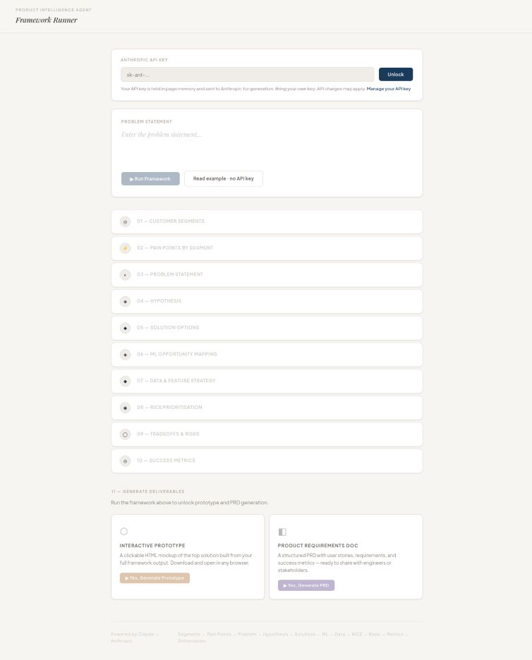

# Product Intelligence Agent

**A guided AI workflow from a product problem to priorities, metrics and a delivery brief.**

The agent turns one problem statement into a connected product analysis. It recognises marketplace and B2B signals, carries context between stages, and lets the product manager steer the analysis before continuing. The result can become a downloadable PRD and an interactive HTML prototype.

[Browser tool](https://srishty-pm.github.io/product-framework-improvedagent/) · [Example walkthrough](docs/example-walkthrough.md) · [Portfolio](https://github.com/Srishty-PM/cv) · [Srishty Pahujani](https://srishtypahujani.com/)



## Why it exists

Product frameworks are useful, but disconnected worksheets make it easy to lose the reasoning between the customer problem, the solution and the success measure. This project explores a coherent workflow with human judgement retained at each stage.

## What it does

| Stage | Output |
| --- | --- |
| 1–3: Understand | Customer segments, pain points and a structured problem statement. |
| 4–5: Explore | Testable hypotheses and several solution options. |
| 6–7: Assess AI value | ML opportunities, data features and cold-start considerations. |
| 8–10: Decide | Illustrative RICE scoring, trade-offs, risks and success metrics. |
| Deliverables | An editable Markdown PRD and a downloadable HTML prototype. |

Marketplace prompts distinguish supply, demand and matching, and introduce liquidity and marketplace-health measures. B2B segmentation distinguishes buyer from user. The classifier is keyword-based; it is not a trained model.

After each intermediate stage, choose **Continue** or **Add note before continuing**. Notes carry into later analysis stages. Generated outputs are proposals to review, not customer research or validated prioritisation evidence.

## Explore it

For a review without credentials, start with the [annotated example](docs/example-walkthrough.md).

For live generation:

1. Open the browser tool.
2. Enter your own Anthropic API key and choose **Unlock**. API usage depends on your account and may incur charges.
3. Enter a specific product problem and run the framework.
4. Review each stage, add constraints where useful, and continue.
5. Generate a PRD or prototype after the framework completes.

Example input:

> Customers can find local repair specialists, but struggle to judge reliability and book a suitable appointment. Specialists struggle to fill unused capacity. Design a first version of a two-sided repair marketplace.

## Run locally

```sh
git clone https://github.com/Srishty-PM/product-framework-improvedagent.git
cd product-framework-improvedagent
python3 -m http.server 8000
```

Open `http://localhost:8000`. There is no dependency installation or build step.

## Implementation and boundaries

- **Stack:** vanilla HTML, CSS and JavaScript with Anthropic's Messages API.
- **Entry point:** `index.html` contains the interface, prompt definitions and workflow.
- **Key handling:** the API key is held in page memory and sent to Anthropic for requests; there is no backend credential store.
- **Generated prototypes:** the inline preview uses a sandboxed iframe. Review downloaded generated code before executing it elsewhere.
- **Limits:** model output can be wrong, the RICE numbers are illustrative, and the prototype has no automated research-grounding or quality guarantee. Live calls depend on network access, account permissions and the configured model.

The earlier dark interface is retained under [`experiments/framework-runner-dark.html`](experiments/framework-runner-dark.html). The related [framework-agent repository](https://github.com/Srishty-PM/product-framework-agent) is an earlier iteration. This repository is the preferred guided version to review.

Built by **Srishty Pahujani**, using AI-assisted development · [Website](https://srishtypahujani.com/) · [LinkedIn](https://www.linkedin.com/in/srishtypahujani/)
